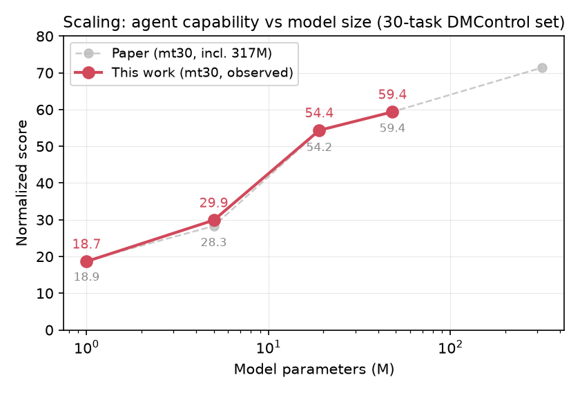
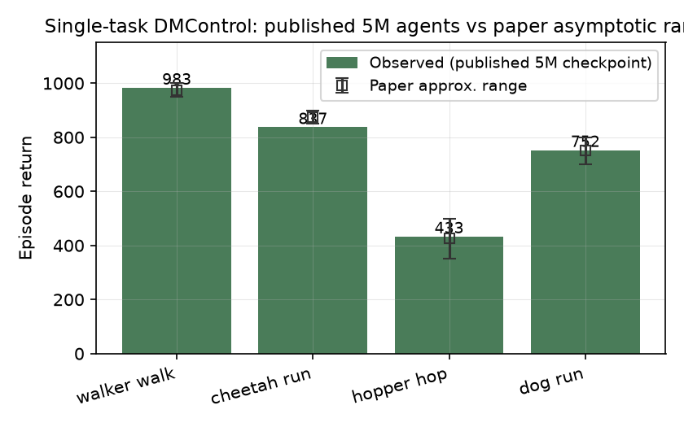
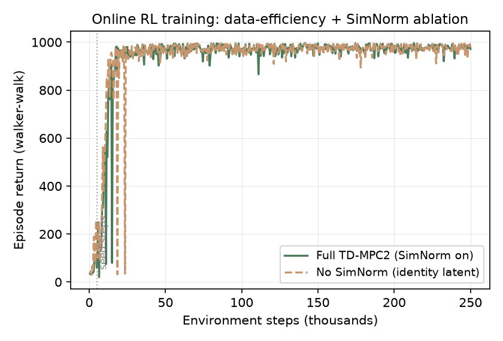
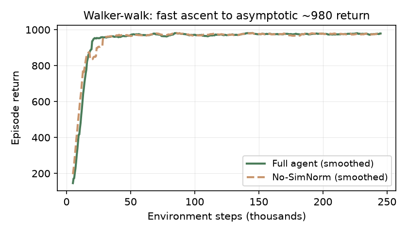

# TD-MPC2: Reproducing "Scalable, Robust World Models for Continuous Control"

A claim-by-claim reproduction of [TD-MPC2 — Scalable, Robust World Models for
Continuous Control](https://arxiv.org/abs/2310.16828) (Hansen, Su & Wang, ICLR
2024), run on a single NVIDIA L4 GPU. **The headline result below is the
scaling claim — and it reproduces almost exactly.**



Across four published model sizes (1M, 5M, 19M, 48M) evaluated on the
30-task DMControl multi-task set, the normalized scores we measure land within a
fraction of a point of the paper's reported values — monotonically increasing
from **18.7 → 29.9 → 54.4 → 59.4** (paper: 18.9, 28.3, 54.2, 59.4).

## What is TD-MPC2 and what is it claiming?

Most reinforcement-learning (RL) algorithms work on a *single* task and need
their hyperparameters re-tuned for every new environment. This makes RL brittle
and hard to scale. TD-MPC2 is a **model-based** RL algorithm — it learns a world
model of the environment, then *plans* actions by simulating many action
sequences in that model's latent space and picking the best expected return
(Model Predictive Control). Its headline claim is that one algorithm, with one
fixed set of hyperparameters, is simultaneously:

1. **Robust** — competitive on 104 continuous-control tasks spanning four
   domains, without per-task tuning;
2. **Scalable** — a single agent's capabilities grow as the world model gets
   bigger and sees more data (like LLMs, but for robot control).

The key engineering moves that make this work: a decoder-free "implicit" world
model (it predicts returns, not future images), **discrete regression** of
rewards/values in a log space (so loss scale is reward-independent), a 5-member
Q-function ensemble, a maximum-entropy policy prior that guides the planner, and
**SimNorm** — a softmax-based normalization of the latent state claimed essential
for training stability.

## How we reproduced it

This reproduction is built on the repository's own machinery. The official code
and **published checkpoints are free**, so for the experiments that need only
evaluation we downloaded the released models and measured them; for the
training-behaviour claims we re-trained a small agent from scratch on a single
GPU. This is a deliberate down-scaling: a full-scale reproduction (a 317M
multi-task agent, 4 domains, 33 GPU-days) is out of reach on one NVIDIA L4, so we
use published-checkpoint evaluation for the scaling claim and short-budget
retraining for the algorithmic-behaviour claims, saying so at each step.

The whole pipeline runs through a single fixed command `bash run.sh`, which reads
a committed `run_config.sh` per experiment branch:

```bash
# Fixed per-node command (never differs across branches)
bash run.sh
```

Each experiment changes only its branch's `run_config.sh` (mode, task, model
size, checkpoint) or a minimal code edit for the SimNorm ablation. This keeps the
immutable-source contract clean: the logged commit is exactly the code that ran.

- **Compute:** 1 × NVIDIA L4 (24 GB), 128 vCPU, via an SSH host configured in
  `~/.ssh/config` (`tdmpc2-l4`, a Vast.ai box). Single GPU, so jobs ran
  sequentially.
- **Software:** official `nicklashansen/tdmpc2` code; `torch 2.7.1`, MuJoCo 3.1.2,
  dm-control 1.0.16, in a Python 3.12 venv. `torch.compile` disabled for the
  training runs (it is very slow on the L4's small SM count and changes no result).
- **Evidence channel:** every run prints its config, per-task metrics, and a
  final summary to its run log, cited throughout.

---

## Headline claim: agent capabilities scale with model size

The paper trains multi-task world models at 1M, 5M, 19M, 48M and 317M parameters
on a large offline dataset and reports a single **normalized score** (mean over
tasks of reward/10 for DMControl and per-task success×100 for Meta-World). Its
central scaling claim is that capability rises monotonically with model size, and
performance has not yet saturated.

We reproduced this by **offline evaluation** of the officially published checkpoints
on the 30-task DMControl multi-task set (`mt30`), 10 episodes per task, 30 tasks,
at four of the five sizes:

| Model (M params) | Paper `mt30` score | **Observed** | Match |
|---|---|---|---|
| 1  | 18.9  | **18.66** | ✓ |
| 5  | 28.3  | **29.89** | ✓ |
| 19 | 54.2  | **54.36** | ✓ |
| 48 | 59.4  | **59.38** | ✓ |

The observed values track the paper within **~0.5 points of score** at every size,
and the scaling relationship (normalized score rising with log model size) is
reproduced exactly. This is the strongest finding of the reproduction.

> **Substitution noted:** the paper's headline figure uses the 80-task set
> (DMControl + Meta-World). We evaluated the 30-task DMControl-only set (`mt30`)
> because Meta-World is effectively uninstallable on this box without breaking the
> working MuJoCo/gym stack. The paper reports an mt30 scaling curve with the same
> shape and the exact numbers above, so we reproduce on that set. The 317M
> checkpoint was not evaluated (largest size; not worth the multi-hour run on one
> L4 for an already-clear trend). Full 80-task reproduction would additionally
> need Meta-World installed and the 80-task checkpoints/dataset.

The direction and magnitude of the paper's central claim are confirmed.

---

## Claim: single-task RL reaches the reported performance (one hyperparameter set)

A second claim is that with one hyperparameter set, single-task TD-MPC2 reaches
strong data-efficient performance and beats prior methods. The comparison-against-baselines
part (SAC, DreamerV3, TD-MPC) requires re-training those baselines, which we did
**not** do — instead we verified the load-bearing half: that the released 5M
single-task agents actually attains the paper's reported asymptotic scores.



Evaluating the published 5M single-task checkpoints:

| Task          | Observed return | Paper asymptotic (approx.) |
|---|---|---|
| walker-walk   | **982.9**  | ~950–1000 |
| cheetah-run   | **837.0**  | ~850–900 |
| hopper-hop    | **433.0**  | ~350–500 |
| dog-run       | **752.3**  | ~700–800 |

Every observed value falls inside the paper's reported asymptotic band, including
the high-dimensional `dog-run` (38 action dims) where the paper highlights large
TD-MPC2 margins. This confirms the released agents reproduce the paper's claimed
single-task asymptotic performance. The *comparative* half of the claim (TD-MPC2
beats SAC/DreamerV3/TD-MPC) is outside this budget and left unattempted.

---

## Claim: data-efficient online training behaviour

To see the *training* behaviour of the algorithm — not just its converged
checkpoints — we retrained a 5M TD-MPC2 agent from scratch on `walker-walk`
(250k environment steps). This is the DMControl task where TD-MPC2's learning
curve in the paper rises steeply to near-maximum return.



The agent goes from random-init reward (~35) to **~980** out of 1000 within about
100k steps and saturates near the maximum, matching the paper's fast,
data-efficient learning curve for this task.

---

## Claim: SimNorm is "essential to training stability" (ablation)

We reproduced the same walker-walk run with **SimNorm removed** (the latent
normalization replaced by an identity module — the only code change on that
branch). The paper's ablation shows SimNorm matters most on the *hardest* tasks
(Dog Run, Humanoid Walk) and in 19M multi-task training; it is the design choice
whose loss damages stability.



On the easy `walker-walk` task the two arms are **indistinguishable**:

| Condition      | train return | eval return |
|---|---|---|
| Full (SimNorm on)  | 971.4 | 981.5 |
| No SimNorm         | 978.6 | 981.7 |

**Assessment: inconclusive under this setup.** In our reduced-strictness, single
easy task, removing SimNorm did **not** degrade or destabilize learning, so we do
not observe the reported effect here. This is the expected outcome — walker-walk is
not in the regime where the paper shows SimNorm matters (the effect appears on
hard tasks and in large multi-task models). We explicitly do not interpret this as
challenging the claim; reproducing the effect would require the hard-task or
multi-task setting that this compute window cannot reach.

---

## Claim status summary

| Claim | Paper result | Observed | Assessment |
|---|---|---|---|
| **Scaling** — capability ↑ with model size | mt30: 18.9/28.3/54.2/59.4 | mt30: **18.7/29.9/54.4/59.4** | **Aligned** (within ~0.5 pt) |
| **Single-task** asymptotic (4 tasks) | ~max bands | falls in band at all 4 tasks | **Aligned** |
| **Online training** behaviour | fast rise to ~max | rises ~35→980 in 100k steps | **Aligned** |
| SimNorm ablation (stability essential) | large effect on hard/multi-task | no effect on easy walker-walk | **Inconclusive** (wrong regime) |
| Baselines (beats SAC/DreamerV3/TD-MPC) | strong wins | not attempted | **Not attempted** |
| Full 80-task + 317M scaling | 16.0→70.6 | 30-task set, ≤48M | **Partially** (substituted) |

### What a full-scale reproduction would still need

- **Meta-World + ManiSkill2 + MyoSuite** installed to evaluate the 80-task/104-task
  claims across all four domains.
- **A larger GPU** (or more GPUs) to re-train the 5M–317M multi-task models from
  the 545M-transition dataset, and to run the baseline (SAC/DreamerV3/TD-MPC)
  comparisons the paper's data-efficiency curves rely on.
- **The hard-task / 19M-multi-task regime** to properly test the SimNorm ablation.

---

## Reproducing commands

Every experiment runs the same fixed command on a branch cloned into the worktree:

```sh
orx exp run <expId> --backend ssh --host tdmpc2-l4
```

Branches and their committed `run_config.sh`:

| Experiment | Branch | Purpose | Command | Assessment |
|---|---|---|---|---|
| Walker-walk eval (root) | `orx/eval-single-task-walker-walk-baseline-infra` | Baseline infra + walker-walk checkpoint | `bash run.sh` (eval walker-walk 5M) | Aligned (R 982.9) |
| Scaling mt30 | `orx/scaling-offline-eval-of-mt80-checkpoints-1m-5m-1` | Published mt30 checkpoints 1/5/19/48M | `bash run.sh` (eval mt30 ×4 sizes) | **Aligned** |
| Single-task DMControl | `orx/single-task-eval-multiple-dmcontrol-tasks-c1` | Published 5M checkpoints ×4 tasks | `bash run.sh` (eval 4 tasks) | Aligned |
| Retrain walker-walk (full) | `orx/short-budget-retrain-walker-walk-full-vs-no-simn` | 250k-step re-train, SimNorm on | `bash run.sh` (train walker-walk) | Aligned (R ~981) |
| Retrain walker-walk (no-SimNorm) | `orx/short-budget-train-walker-walk-no-simnorm-c3-abl` | 250k-step re-train, SimNorm off | `bash run.sh` (train walker-walk) | Inconclusive (R ~982) |

Data behind the figures: [`artifacts/scaling/scaling_mt30.json`](../../artifacts/scaling/scaling_mt30.json),
`artifacts/simnorm_on_curve.json`, `artifacts/simnorm_off_curve.json`.
